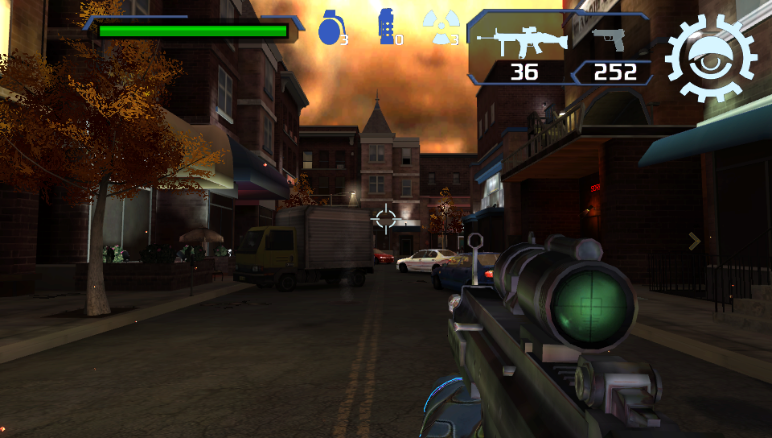

# The Conduit HD Vita

<p align="center"></p>

This is a wrapper/port of *The Conduit HD* for the *PS Vita*.

The port works by loading the official Android ARMv7 executable in memory, resolving its imports with native functions and patching it in order to properly run.
By doing so, it's basically as if we emulate a minimalist Android environment in which we run natively the executable as is.

## Setup Instructions (For End Users)

(If you have already installed the game and want to update to a newer release, you can simply install [CONDUIT.vpk](https://github.com/TheOfficialFloW/conduit_vita/releases/download/v1.0/CONDUIT.vpk) on your *PS Vita*).

In order to properly install the game, you'll have to follow these steps precisely:

- Install [kubridge](https://github.com/TheOfficialFloW/kubridge/releases/) and [FdFix](https://github.com/TheOfficialFloW/FdFix/releases/) by copying `kubridge.skprx` and `fd_fix.skprx` to your taiHEN plugins folder (usually `ux0:tai`) and adding two entries to your `config.txt` under `*KERNEL`:
  
```
  *KERNEL
  ux0:tai/kubridge.skprx
  ux0:tai/fd_fix.skprx
```

**Note** Don't install fd_fix.skprx if you're using repatch plugin

- **Optional**: Install [PSVshell](https://github.com/Electry/PSVshell/releases) to overclock your device to 500Mhz.
- Install `libshacccg.suprx`, if you don't have it already, by following [this guide](https://samilops2.gitbook.io/vita-troubleshooting-guide/shader-compiler/extract-libshacccg.suprx).
- Obtain your copy of *The Conduit HD* legally for Android in form of an `.apk` file and a `.obb` file (usually `main.11.com.highvoltage.theconduit.obb` located inside the `/sdcard/android/obb/com.highvoltage.theconduit/`) folder. [You can get all the required files directly from your phone](https://stackoverflow.com/questions/11012976/how-do-i-get-the-apk-of-an-installed-app-without-root-access) or by using an apk extractor you can find in the play store. The apk can be extracted with whatever Zip extractor you prefer (eg: WinZip, WinRar, etc...) since apk is basically a zip file. You can rename `.apk` to `.zip` to open them with your default zip extractor.
- Open the apk with your zip explorer, extract the file `libTheConduit.so` from the `lib/armeabi-v7a` folder to `ux0:data/conduit`. 
- Rename the file `main.11.com.highvoltage.theconduit.obb` to `main.obb` and copy it to `ux0:data/conduit/main.obb`.
- Install [CONDUIT.vpk](https://github.com/TheOfficialFloW/conduit_vita/releases/download/v1.0/CONDUIT.vpk) on your *PS Vita*.

## Build Instructions (For Developers)

In order to build the loader, you'll need a [vitasdk](https://github.com/vitasdk) build fully compiled with softfp usage.  
You can find a precompiled version here: https://github.com/vitasdk/buildscripts/actions/runs/1102643776.  
Additionally, you'll need these libraries to be compiled as well with `-mfloat-abi=softfp` added to their CFLAGS:

- [mpg123](http://www.mpg123.de/download/mpg123-1.25.10.tar.bz2)

  - Apply [mpg123.patch](https://github.com/vitasdk/packages/blob/master/mpg123/mpg123.patch) using `patch -Np0 -i mpg123.patch`.

  - ```bash
    autoreconf -fi
    CFLAGS="-DPSP2 -mfloat-abi=softfp" ./configure --host=arm-vita-eabi --prefix=$VITASDK/arm-vita-eabi --disable-shared --enable-static --enable-fifo=no --enable-ipv6=no --enable-network=no --enable-int-quality=no --with-cpu=neon --with-default-audio=dummy --with-optimization=3
    make install
    ```

- [openal-soft](https://github.com/isage/openal-soft/tree/vita-1.19.1)

  - ```bash
    cd build
    cmake -DCMAKE_TOOLCHAIN_FILE=${VITASDK}/share/vita.toolchain.cmake -DCMAKE_BUILD_TYPE=Release -DCMAKE_C_FLAGS=-mfloat-abi=softfp .. && make install
    ```

- [libmathneon](https://github.com/Rinnegatamante/math-neon)

  - ```bash
    make install
    ```

- [vitaShaRK](https://github.com/Rinnegatamante/vitaShaRK)

  - ```bash
    make install
    ```

- [kubridge](https://github.com/TheOfficialFloW/kubridge)

  - ```bash
    mkdir build && cd build
    cmake .. && make install
    ```

- [vitaGL](https://github.com/Rinnegatamante/vitaGL)

  - ````bash
    make SOFTFP_ABI=1 PHYCONT_ON_DEMAND=1 STORE_DEPTH_STENCIL=1 SAMPLERS_SPEEDHACK=1 TEXTURES_SPEEDHACK=1 NO_DEBUG=1 install
    ````

Finally, in the folder of `conduit_vita`, install SceLibc stubs using:

```bash
make -C libc_bridge install
```

After all these requirements are met, you can compile the loader with the following commands:

```bash
mkdir build && cd build
cmake .. && make
```

## Credits

- Rinnegatamante for vitaGL and helping with porting the renderer.
- Brandonheat8 for LiveArea assets.
- CatoTheYounger for betatesting.
